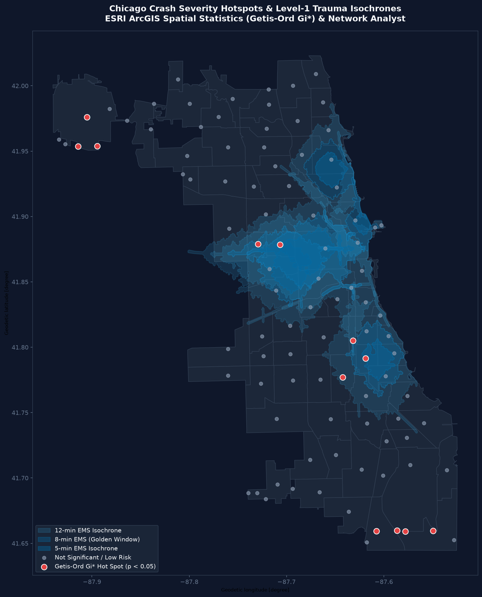

<div align="center">

# 🚦 Road Accident Severity Prediction & Geospatial Risk Mapping

Machine learning + geospatial analytics on **~940,000 Chicago traffic crashes** — severity
classification with LightGBM, SHAP/LIME explainability, and DBSCAN hotspot detection with
severity-weighted risk indices.

[](https://sanya28wd.github.io/Road-Accident-Severity-Prediction/)
[](https://www.python.org/)
[](road-accident-severity/reports/metrics.json)
[](road-accident-severity/GeospatialRisk/Chicago/dbscan_hotspots.py)
[](road-accident-severity/GeospatialRisk/Chicago/esri_pipeline.py)
[](https://chirudeva-reddy.github.io/Road-Accident-Severity-Prediction/)
[](report/report.pdf)

### 👉 [**Try the live dashboard**](https://sanya28wd.github.io/Road-Accident-Severity-Prediction/) — adjust the inputs and watch the prediction move.

[](https://sanya28wd.github.io/Road-Accident-Severity-Prediction/)

</div>

---

## 🧭 Jump to

| | | |
|---|---|---|
| [📊 Dataset & clustering](#-dataset--dbscan-hotspot-clustering) | [📈 Risk score](#-weighted-severity-risk-score) | [🧠 Model results](#-model-results--explainability) |
| [🗺️ ESRI ArcGIS analytics](#-esri-arcgis-enterprise-pipeline--spatial-statistics) | [🧱 Project structure](#-project-structure) | [🚀 Getting started](#-getting-started) |
| [📄 Project report](#-project-report) | [👥 Contributors](#-contributors) | |

---

## 📌 What this project answers

1. **Severity prediction** — will a crash result in *injury / tow* or *no injury / drive away*, given road, weather, lighting, time and vehicle attributes?
2. **Hotspot detection** — where do crashes cluster spatially? Found with **DBSCAN** using Haversine distance.
3. **Regional risk scoring** — which of Chicago's 77 community areas carry the most severity-weighted risk, not just the most crashes?
4. **Interactive exploration** — Plotly / Folium / Dash apps, plus the published dashboard above.

---

<details open>
<summary><h2>📊 Dataset & DBSCAN Hotspot Clustering</h2></summary>

### Chicago Traffic Crashes — *~940,000 records*

- **Source**: City of Chicago `Traffic_Crashes_-_Crashes.csv` (173 MB, not committed — see [Getting started](#-getting-started)).
- **Spatial unit**: the 77 official Chicago Community Areas (`Boundaries - Community Areas`).
- **Processing**:
  - Full cleaning pipeline: missing values, temporal features, injury categorisation.
  - Spatial join linking crash point geometries to the 77 community-area polygons (`EPSG:4326`).
  - **Scalable grouped DBSCAN** — clustering runs per community area (`group_col="community_area_number"`) so ~940k points cluster without blowing up memory on a single global distance matrix.
  - Crash-level, community-level and cluster-level severity risk indices.
- **Visualisations**: Dash apps (`dashapp.py`, `interactive_dash.py`) with live filtering by community area, minimum crash threshold and severity category.

</details>

<details>
<summary><h2>📈 Weighted Severity Risk Score</h2></summary>

Raw crash counts reward busy roads, not dangerous ones. Each region and cluster instead gets a
severity-weighted index:

$$\text{Risk Index} = \frac{3 \times \text{Fatal} + 2 \times \text{Incapacitating} + 1 \times \text{Non-Incapacitating} + 0.5 \times \text{Possible Injury}}{\text{Total Crashes}}$$

| Severity level | Weight | Description |
|---|---|---|
| **Fatal injury** | `3.0` | Fatal crashes |
| **Incapacitating injury** | `2.0` | Severe injuries requiring hospitalisation |
| **Non-incapacitating injury** | `1.0` | Evident but non-incapacitating injuries |
| **Possible injury** | `0.5` | Reported minor injury / pain |

A higher score means severe and fatal outcomes are concentrated there relative to crash volume.

</details>

<details>
<summary><h2>🧠 Model Results & Explainability</h2></summary>

Binary target: `INJURY AND / OR TOW DUE TO CRASH` vs `NO INJURY / DRIVE AWAY`.
Five-fold stratified cross-validation, SMOTE for class imbalance.

| Model | Macro F1 | Balanced accuracy |
|---|---|---|
| **LightGBM** ✅ | **0.804** | **0.797** |
| XGBoost | 0.804 | 0.796 |
| ExtraTrees | 0.781 | 0.770 |
| LogReg + SMOTE | 0.743 | 0.785 |
| LogisticRegression | 0.741 | 0.785 |

**Held-out test set (LightGBM):** macro F1 **0.806**, balanced accuracy **0.799**
— see [`reports/metrics.json`](road-accident-severity/reports/metrics.json).

**Explainability** (`explainability.py`): SHAP global + local attribution and LIME instance
explanations, highlighting speed limit, road alignment, weather and lighting as the dominant
severity drivers. Outputs land in [`reports/explainability_outputs/`](road-accident-severity/reports/explainability_outputs).

</details>

<details open>
<summary><h2>🗺️ ESRI ArcGIS Enterprise Pipeline & Spatial Statistics</h2></summary>

### 👉 [**Open the live hotspot map**](https://chirudeva-reddy.github.io/Road-Accident-Severity-Prediction/): DBSCAN and Getis-Ord Gi* side by side, with trauma-center drive times.

### Why the ESRI Gi* analysis replaces the DBSCAN hotspots

The first version of this project used hand-tuned DBSCAN to find hotspots. The ESRI pipeline
(`esri_pipeline.py`) is the more reliable way to find **where crashes are severe**, for three reasons:

| | DBSCAN (previous) | ESRI Getis-Ord Gi* (current) |
|---|---|---|
| **What it measures** | Where crash *points* are dense | Where *severity-weighted* scores cluster more than chance allows |
| **Confidence** | None. A cluster is a cluster | A $z$-score and $p$-value for every location |
| **Weighting** | A fender-bender and a fatality count the same | Fatal ×3, incapacitating ×2, non-incapacitating ×1 |
| **Tuning** | One hand-picked radius (`eps = 250 m`) | 3 km fixed distance band against a citywide baseline |

The data backs this up:
- **Volume does not predict severity.** Across the 98 clusters, crash count and severity score correlate at **r = −0.14**.
- **DBSCAN's clusters merged into whole neighbourhoods.** At a 250 m radius the clusters chain along Chicago's street grid: **71 of 98 clusters** have exactly the same crash total as an entire community area, so they act as area totals rather than hotspots.
- **The two methods do not overlap.** **None** of the 12 Gi* hot spots is among the 20 busiest DBSCAN clusters (Austin, Near North Side, the Loop, …).

DBSCAN is still useful for showing where crashes are *frequent* (congestion and enforcement planning). Use Gi* for where people are most likely to be seriously hurt.

```
                            Dual Spatial Analytics Architecture
                                             │
            ┌────────────────────────────────┴────────────────────────────────┐
            ▼                                                                 ▼
    [DBSCAN Clustering]                                             [ESRI ArcGIS Pipeline]
   • Haversine density radius                                      • Spatially Enabled DataFrame (SEDF)
   • Identifies traffic volume clusters                            • Getis-Ord Gi* Spatial Autocorrelation
   • Biased toward congestion zones                                • 5/8/12-min Trauma Center Isochrones
                                                                   • EMS Response Gap Identification
```

#### 1. Spatially Enabled DataFrames (SEDF)
- Loads the 98 DBSCAN cluster centroids and the 77 community-area polygons, with their risk tables, into ESRI Spatially Enabled DataFrames (`arcgis.features.GeoAccessor`).

#### 2. Getis-Ord $G_i^*$ Statistical Hot Spot Analysis
- Computes local $G_i^*$ ($z$-scores and $p$-values) on the severity-weighted score of each cluster, 3 km fixed distance band. The statistic is implemented in NumPy inside `esri_pipeline.py` on the SEDF layers.
- **Results (`compare_hotspots.py`)**: **12 hot spots** at 90% confidence or higher: **6 at $p < 0.05$** (5 of them at $p < 0.01$), 6 more at $p < 0.10$. Peak $z = 3.55$.
  - The 95%+ hot spots sit in **O'Hare** and **Hegewisch**. Several of these clusters hold fewer than 100 crashes, so treat them with care: small counts make severity rates noisy.
  - The 90% hot spots are on the **South and West sides**: Englewood, West and East Garfield Park, Washington Park, Fuller Park and Riverdale.
  - 8 clusters are cold spots (1 at $p < 0.05$).

#### 3. Emergency Medical Response (EMS) & Trauma Center Catchment
- Using the **ArcGIS Network Analyst** routing service, generates **5-minute, 8-minute (Golden Window), and 12-minute drive-time service areas (isochrones)** around Chicago's five Adult Level-1 Trauma Centers (*Stroger, UChicago Medicine, Northwestern, Illinois Masonic, Mount Sinai*).
- **Findings**: Only **18 / 98 clusters** fall within the 8-minute window (3 within 5 min, 15 within 5–8 min). **80 clusters** are further out: 11 at 8–12 min and 69 beyond 12 min.

<div align="center">
  
  <p><em>Figure: ESRI Getis-Ord Gi* Hotspots overlaid with Chicago Level-1 Trauma Center 5, 8, and 12-minute drive-time isochrones.</em></p>
</div>

#### 📝 Resume Talking Points
> - **Enterprise GIS & Spatial Data Engineering:** *Built a dual geospatial analytics pipeline with the **ESRI ArcGIS API for Python** (`arcgis.features.GeoAccessor`) and GeoPandas, turning ~940K municipal crash records into DBSCAN clusters and community-area layers loaded as Spatially Enabled DataFrames.*
> - **Spatial Statistics & Hotspot Modeling:** *Implemented **Getis-Ord $G_i^*$** hot spot analysis on severity-weighted crash clusters (12 hot spots, 6 at $p < 0.05$) and showed that volume-based **DBSCAN** ranking missed all of them.*
> - **Network Routing & Healthcare Accessibility:** *Modeled emergency medical response with **ArcGIS Network Analyst** 5/8/12-minute drive-time isochrones from Chicago's Level-1 Trauma Centers, finding 80 of 98 crash clusters outside the 8-minute window.*

</details>

<details>
<summary><h2>🧱 Project Structure</h2></summary>

```
Road-Accident-Severity-Prediction/
├── README.md
├── requirements.txt
├── assets/dashboard-demo.gif
└── road-accident-severity/
    ├── modelling.py                   # Training & cross-validation
    ├── explainability.py              # SHAP / LIME analysis
    ├── reports/                       # Confusion matrix, CV comparison, ESRI map figure
    └── GeospatialRisk/Chicago/
        ├── cleaning.py                # Crash data cleaning pipeline
        ├── prepare_geodata.py         # GeoDataFrame + spatial join (77 community areas)
        ├── dbscan_hotspots.py         # Per-community-area DBSCAN clustering
        ├── severity_pipeline.py       # Crash / area / cluster risk scoring
        ├── esri_pipeline.py           # ArcGIS SEDF, Getis-Ord Gi*, and Network Analyst
        ├── compare_hotspots.py        # DBSCAN vs. Getis-Ord Gi* statistical benchmark
        ├── build_live_map.py          # Bakes outputs into the live hotspot map (docs/index.html)
        └── app/
            ├── dashapp.py             # Choropleth & hotspot dashboard
            └── interactive_dash.py    # Dash app with live filters
```

</details>

<details>
<summary><h2>🚀 Getting Started</h2></summary>

### 1. Install

```bash
git clone https://github.com/Chirudeva-Reddy/Road-Accident-Severity-Prediction.git
cd Road-Accident-Severity-Prediction
git checkout geospatial-clustering-chicago
pip install -r requirements.txt
```

### 2. Get the crash data

The 173 MB crash CSV is gitignored. Download **Traffic Crashes – Crashes** from the
[Chicago Data Portal](https://data.cityofchicago.org/Transportation/Traffic-Crashes-Crashes/85ca-t3if)
and save it to:

```
road-accident-severity/GeospatialRisk/Chicago/dataset/Traffic_Crashes_-_Crashes.csv
```

### 3. Run the geospatial pipeline

```bash
cd road-accident-severity
python -m GeospatialRisk.Chicago.prepare_geodata
python -m GeospatialRisk.Chicago.dbscan_hotspots
python -m GeospatialRisk.Chicago.severity_pipeline
```

> The modules use relative imports, so run them with `-m` from inside `road-accident-severity/`
> — the repo root folder name contains hyphens and is not a valid Python package name.

### 4. Run the ESRI ArcGIS analytics pipeline

```bash
# Execute SEDF conversion, Getis-Ord Gi* hotspots, and trauma isochrone routing
python -m GeospatialRisk.Chicago.esri_pipeline

# Run comparative benchmark (DBSCAN vs. Getis-Ord Gi*)
python -m GeospatialRisk.Chicago.compare_hotspots

# Rebuild the live hotspot map (writes docs/index.html for GitHub Pages)
python -m GeospatialRisk.Chicago.build_live_map
```

### 5. Launch the interactive dashboard

```bash
python GeospatialRisk/Chicago/app/interactive_dash.py
```

Then open `http://127.0.0.1:8050/`.

</details>

---

## 📄 Project Report

The full write-up — motivation, workflow, algorithms, results, SHAP/LIME analysis and the
geospatial study — is typeset in LaTeX:

- **[report/report.pdf](report/report.pdf)** — 15 pages, compiled output
- [report/report.tex](report/report.tex) — source; rebuild with `latexmk -pdf report.tex` from `report/`
- [report/shap-percent-table.tex](report/shap-percent-table.tex) — generated from `shap_top20_percent.csv`

---

## 👥 Contributors

<div align="center">

| [<br><sub><b>Aarushi Kothari</b></sub>](https://github.com/aarushi4-ux) | [<br><sub><b>Shreiya Muthuvelan</b></sub>](https://github.com/Shreiya-Muthuvelan) | [<br><sub><b>Chirudeva Reddy</b></sub>](https://github.com/Chirudeva-Reddy) | [<br><sub><b>Sanya Wadhawan</b></sub>](https://github.com/sanya28wd) |
| :---: | :---: | :---: | :---: |
| `2023A7PS0342U` | `2023A7PS0343U` | `2023A7PS0331U` | `2023A7PS0296U` |

</div>

**Supervisor:** Dr. Ashish Gupta  
**Institution:** BITS Pilani — Dubai Campus, DIAC, Dubai, U.A.E.

Academic project. Licensed for educational and research use.
